# MAGHREBIA
  

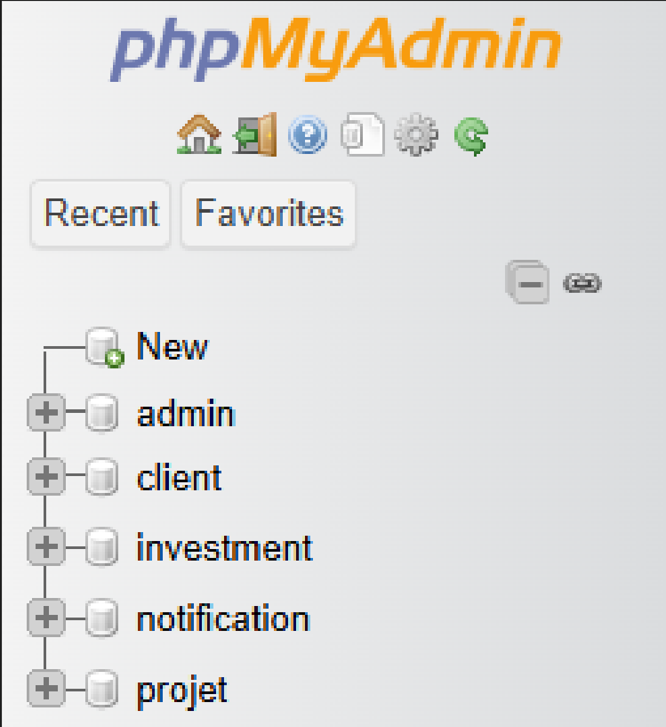

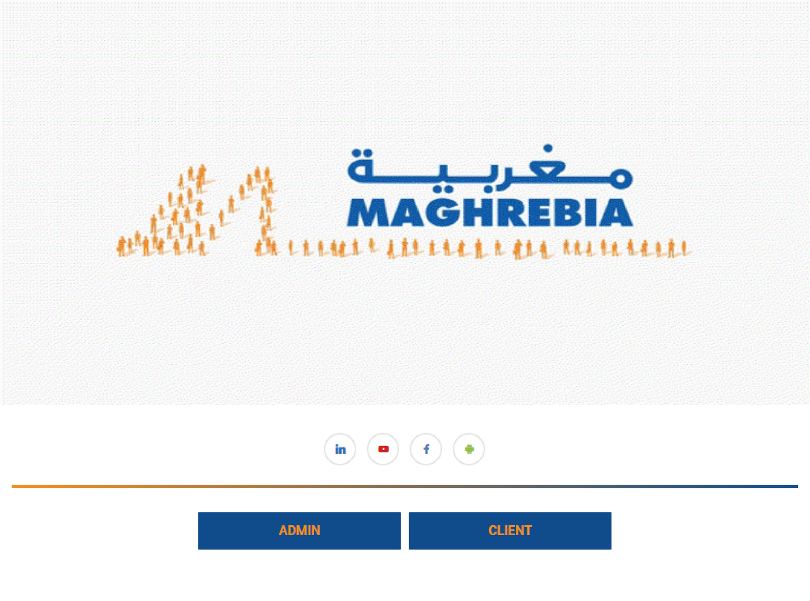
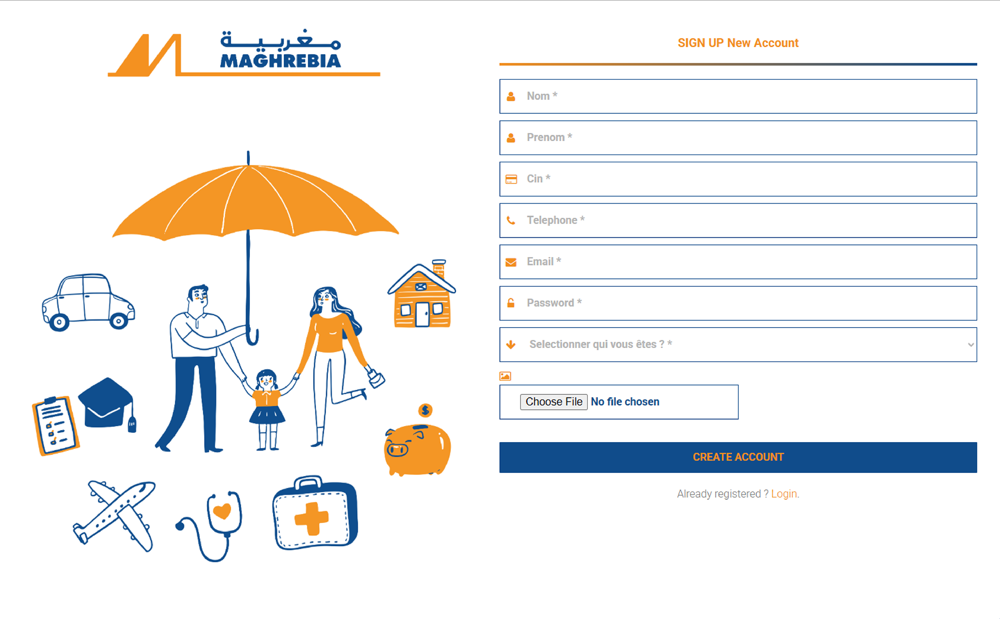
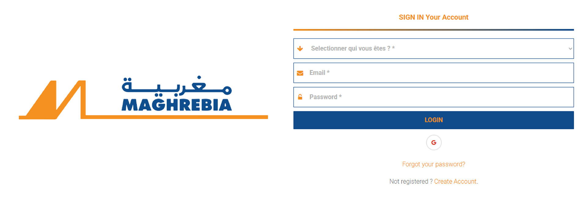

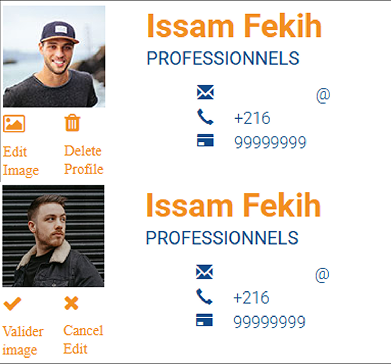
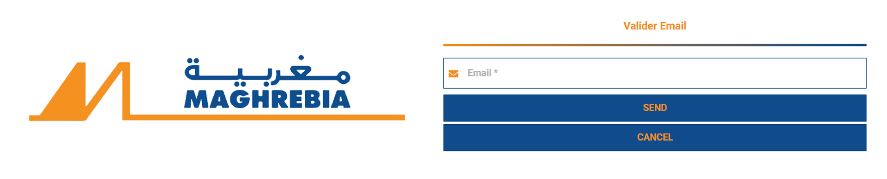
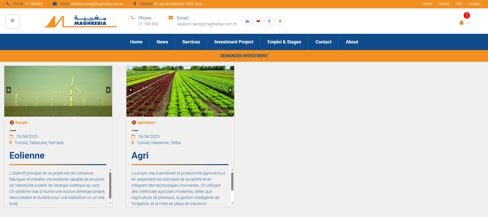

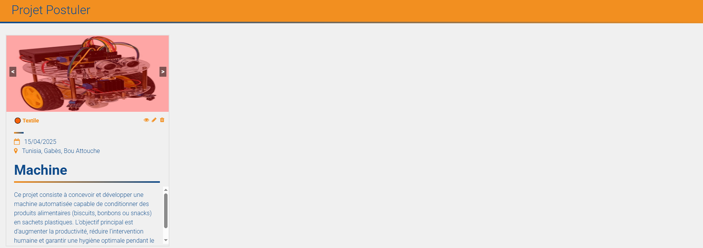
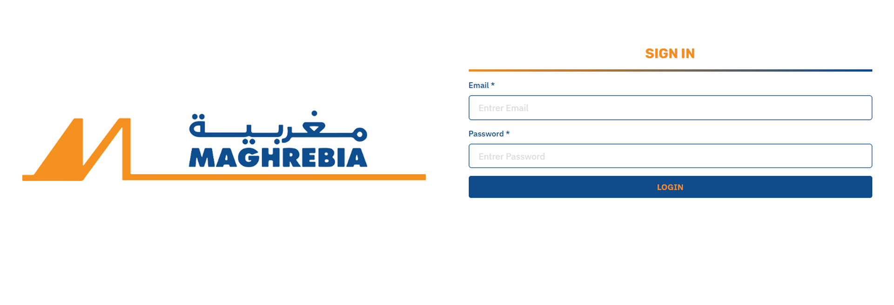
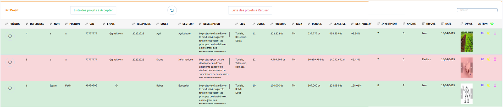
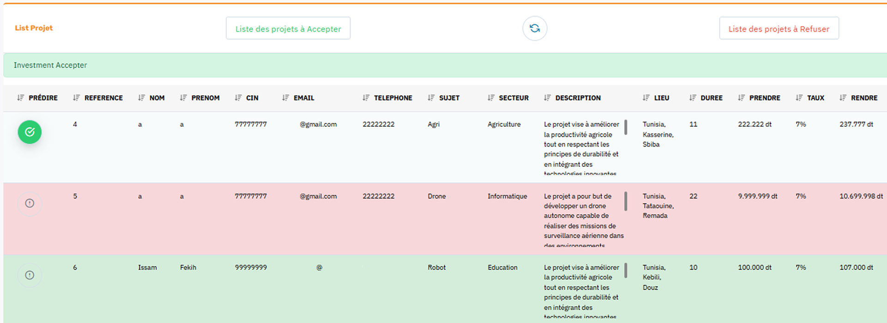
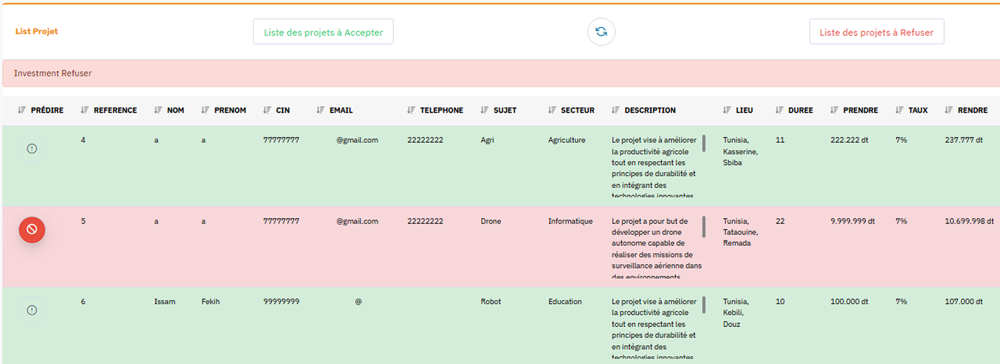

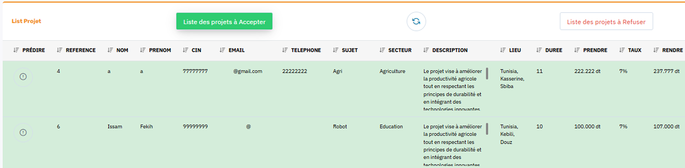

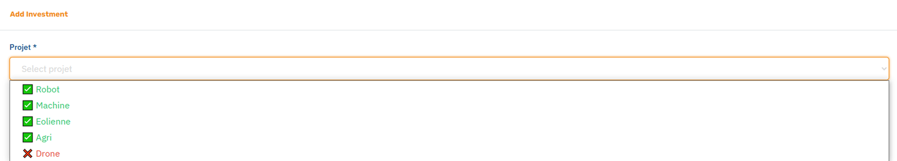
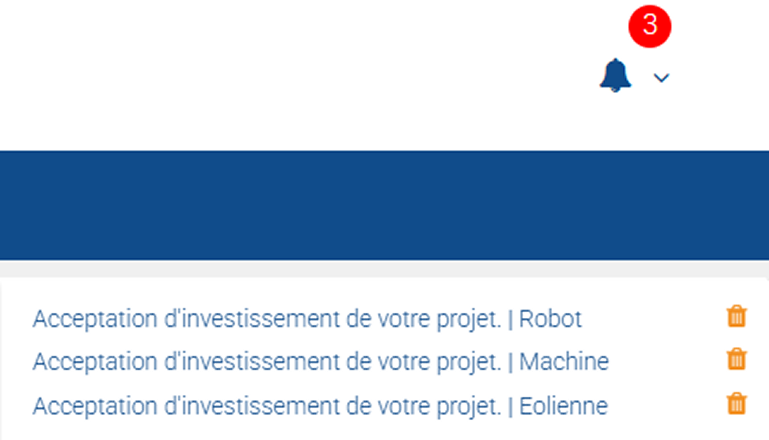
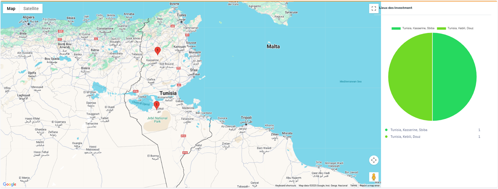

- IDE  
  
  

- FRAMEWORK  
  
  

- LANGUAGE  
  
  

- ENVIRONMENT  
  

- TOOLS  
  
  

- DATABASE  
  

- DISCOVERY  
  

- GATEWAY  
  

- COMMUNICATION  
  

- SERVICE  
  

- MACHINE LEARNING  
  
